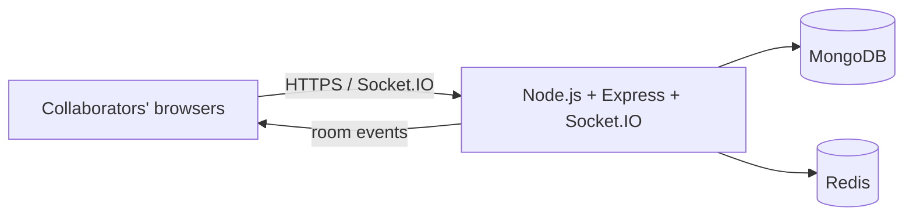

# BoardCollab Architecture (Initial)

## High-level components

## Initial responsibilities

- **React + Konva:** canvas rendering and user interactions.
- **Express:** REST API and health endpoint.
- **Socket.IO:** real-time event transport; authenticated room events will be added next.
- **MongoDB:** durable room/session state.
- **Redis:** planned Socket.IO adapter, ephemeral state, and cross-instance pub/sub.
- **Docker Compose:** local orchestration for frontend, backend, MongoDB, and Redis.

## Planned collaboration flow

1. A client authenticates and requests to join a room.
2. The server validates access and joins the Socket.IO room.
3. A client emits a drawing operation with an operation ID and version metadata.
4. The server validates and broadcasts the operation to other room members.
5. Operations are buffered and persisted in batches; reconnecting clients fetch a snapshot and missed operations.

Conflict resolution strategy and operation schema are not implemented yet; they will be selected and documented during the synchronization phase.
