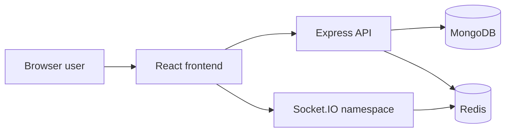

# Project Overview

## Purpose
BoardCollab is a collaborative whiteboard application for teams to create shared visual workspaces in real time. The repository is currently a foundation for the eventual production design, with core collaboration layers still to be implemented.

## Audience
- engineering leadership
- backend, frontend, and DevOps teams
- QA and product stakeholders

## Scope
This document covers the project intent, the current implementation status, and the architectural direction for the monolithic full-stack application.

## Implementation status
Status: Partial implementation.

The repository includes:
- React frontend bootstrapped with Vite
- Express health endpoint
- MongoDB and Redis service composition
- environment configuration

Not yet implemented:
- auth flows
- room logic
- collaborative drawing engine
- state sync and persistence

## Architecture summary
The intended architecture is a modular monolith:
- frontend: React UI with canvas rendering and websocket client
- backend: Express app with modular route/service layers and socket server
- data layer: MongoDB for durable state and Redis for cache/session/pub-sub
- operations: Docker Compose for local environment and future deployment orchestration

## Runtime view

## Open questions
- Which canvas library will be used in production: Konva or Fabric?
- Will room session state be stored in a single document or separated by collection?
- Which conflict-resolution strategy is selected before production rollout?

## Related
- [Requirements and scope](requirements-and-scope.md)
- [System context](system-context.md)
- [System architecture](../02-architecture/system-architecture.md)
