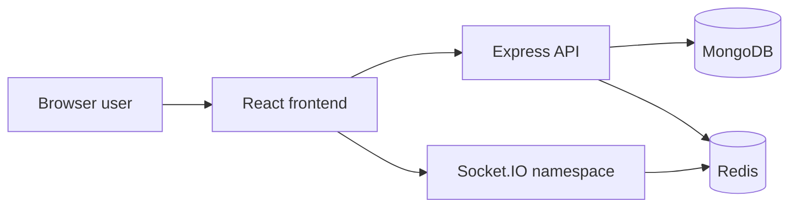

# Project Overview

## Purpose
BoardCollab is a collaborative whiteboard application for teams to create shared visual workspaces in real time. This repository contains a working application and local development stack; production operation still requires environment-specific services and operational controls.

## Audience
- engineering leadership
- backend, frontend, and DevOps teams
- QA and product stakeholders

## Scope
This document covers the project intent, the current implementation status, and the architectural direction for the monolithic full-stack application.

## Implementation status
Status: Core user flows are implemented; scale and production operations remain limited.

Implemented capabilities include JWT account flows, room management, a Konva canvas, authenticated Socket.IO collaboration, presence, undo/redo, offline operation sync, MongoDB persistence, PNG/SVG export, and shape recognition. See the [feature status](../13-project-management/feature-status.md) for limits and test coverage.

## Architecture summary
The intended architecture is a modular monolith:
- frontend: React UI with canvas rendering and websocket client
- backend: Express app with modular route/service layers and socket server
- data layer: MongoDB for durable state and Redis-backed Socket.IO fan-out when Redis is available
- operations: Docker Compose for local development; production app images use external database/cache services

## Runtime view

## Open questions
- What deployment topology and capacity targets will be validated under load?
- What migration and backup/restore process will be operated for production data?
- Should conflict handling evolve beyond the current server-version checks?

## Related
- [Requirements and scope](requirements-and-scope.md)
- [System context](system-context.md)
- [System architecture](../02-architecture/system-architecture.md)
