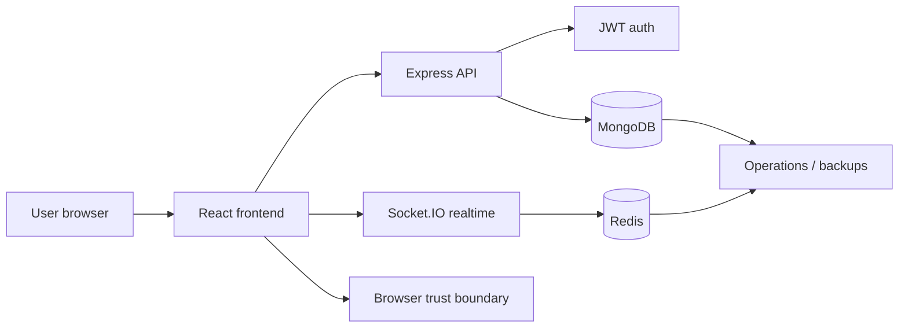

# System Context

## Purpose
Describe how BoardCollab fits into a user and infrastructure environment, including external dependencies and trust boundaries.

## System boundary
The board application sits between the browser client and existing infrastructure services.

## Actors
- end user: creates, joins, or edits rooms
- authenticated collaborator: can draw and interact in a room
- engineering team: configures, tests, and operates services
- infrastructure operator: manages MongoDB, Redis, Docker, and deployment environment

## Context diagram

## Trust boundaries
- Browser to backend: protected via CORS, JWT, and socket auth
- Backend to MongoDB: service-level DB credentials
- Backend to Redis: password-protected cache and pub/sub traffic
- Docker network: Compose services communicate through service DNS; the development stack publishes frontend, backend, MongoDB, and Redis ports for local use. Production Compose binds the app containers to loopback and expects external MongoDB/Redis.

## Implementation status
Status: the runtime integrations are implemented; production infrastructure policy and operations remain deployment responsibilities.

## Related
- [Project overview](project-overview.md)
- [Glossary](glossary.md)
- [Architecture diagrams](../02-architecture/architecture-diagrams.md)
