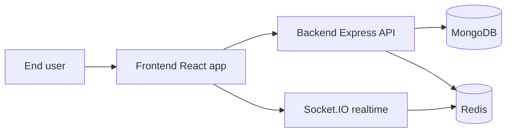
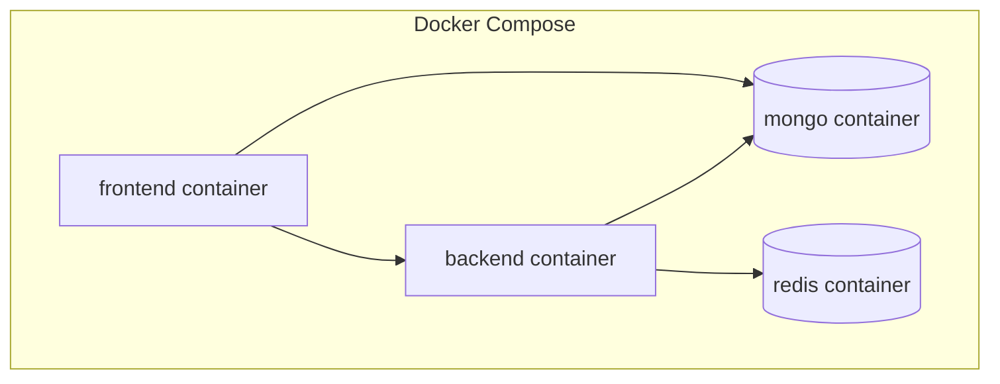
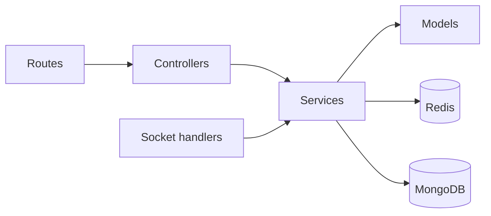
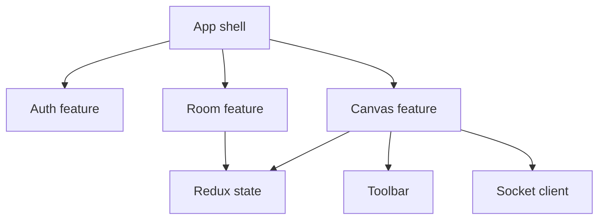
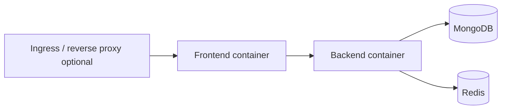
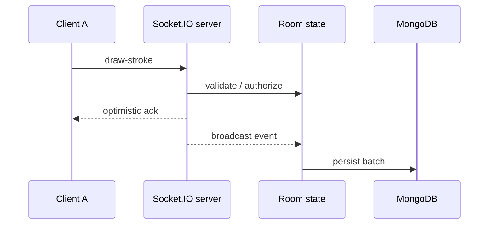
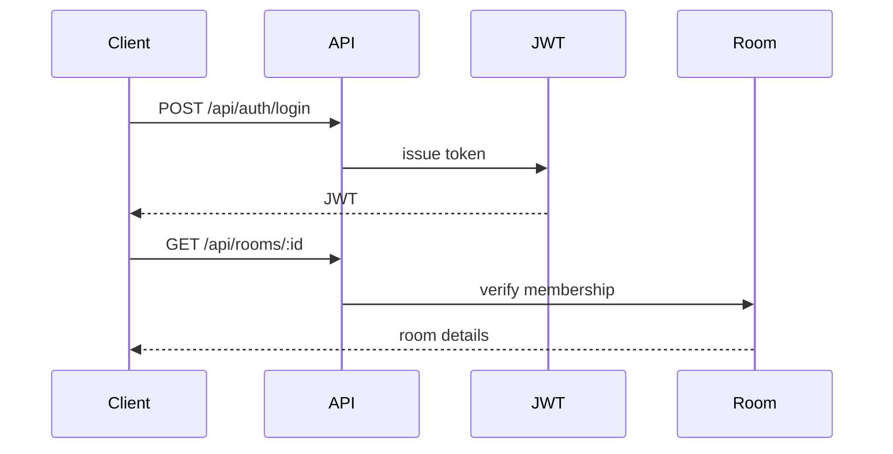
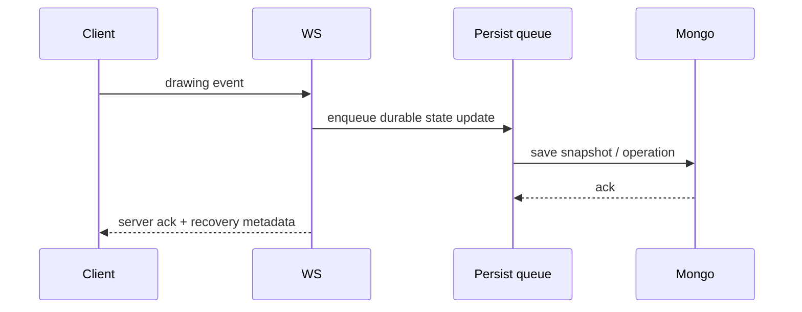
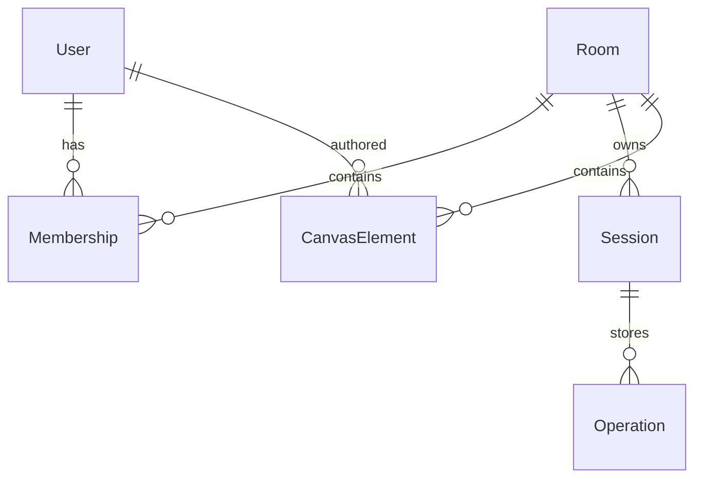

# Architecture Diagrams

## Purpose
Capture the key runtime and deployment views of the design.

## 1. System context

## 2. Container and service architecture

## 3. Backend module dependencies

## 4. Frontend component architecture

## 5. Deployment architecture

## 6. Real-time drawing sequence

## 7. Room join and auth

## 8. Persistence and recovery

## 9. Database entity relationships

## Implementation status
Status: design diagrams are documentation artifacts; runtime features are still planned.

## Related
- [System architecture](system-architecture.md)
- [Real-time communication](real-time-communication.md)
- [Entity relationship diagram](../06-data-design/entity-relationship-diagram.md)
