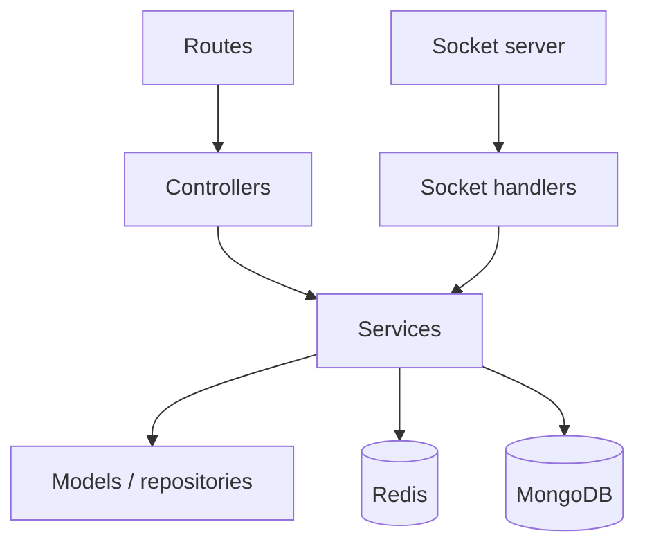

# Backend Architecture

## Purpose
Document the backend’s modular monolith structure and service boundaries.

## Proposed modules
- auth module: registration, login, token issue, user lookup
- rooms module: room creation, membership, metadata reads
- sockets module: room operations and collaborative event handling
- services: persistence and export responsibilities
- middleware: auth, validation, error handling
- config: environment and database configuration

## Layering

## Responsibilities by layer
- routes: HTTP contract entry points
- controllers: request extraction and response shaping
- services: business logic and cross-resource coordination
- models: MongoDB document definitions
- middleware: auth enforcement and centralized error handling
- socket handlers: room membership and event processing

## Engineering principles
- no module should import UI code
- route/modules should stay feature-oriented
- services should own business logic, not controllers
- avoid circular dependencies across modules

## Implementation status
Status: modular routes, controllers, services, models, middleware, and Socket.IO handlers are implemented under `backend/src`.

## Related
- [System architecture](system-architecture.md)
- [Backend structure](../03-backend/backend-structure.md)
- [Module responsibilities](../03-backend/module-responsibilities.md)
