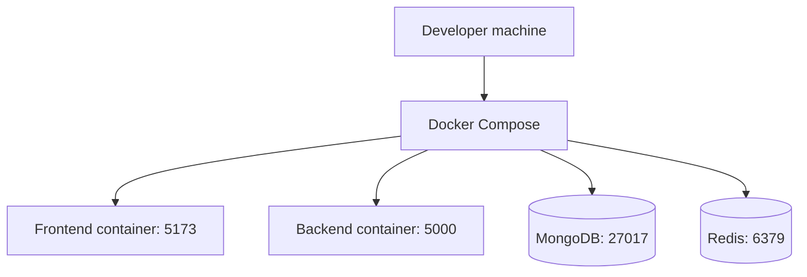

# Deployment Architecture

## Purpose
Document the runtime deployment model for local development and projected production execution.

## Current deployment
The repository uses Docker Compose with four services:
- frontend
- backend
- MongoDB
- Redis

## Current docker-compose evidence
- backend and frontend containers mount repo code into the container
- database and cache services expose local ports
- Node app runs in development mode
- health checks are configured for MongoDB and Redis

## Diagram

## Production considerations
- do not expose database credentials in source control
- separate production secrets from development env files
- use managed MongoDB and Redis services in production
- keep frontend and API behind a reverse proxy for TLS and traffic shaping

## Implementation status
Status: local deployment foundation exists; production deployment plan is pending.

## Related
- [Docker architecture](../08-infrastructure/docker-architecture.md)
- [Environment configuration](../08-infrastructure/environment-configuration.md)
- [Production deployment](../08-infrastructure/production-deployment.md)
