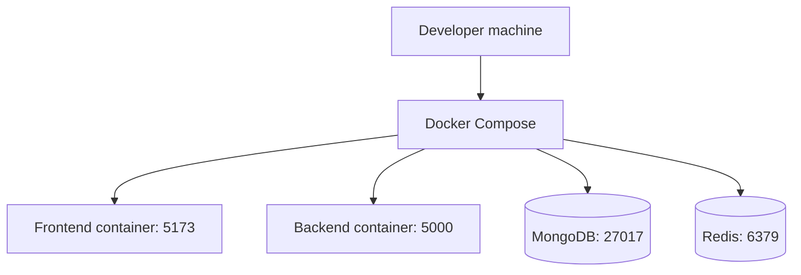

# Deployment Architecture

## Purpose
Document the runtime deployment model for local development and projected production execution.

## Development deployment
`docker-compose.yml` runs four services:
- frontend
- backend
- MongoDB
- Redis

The frontend and backend mount source for hot reload. MongoDB and Redis publish host ports and retain data in named volumes. The backend starts after their health checks and the frontend starts after the API health check. Test users are seeded only when requested explicitly.

## Production app containers
`docker-compose.prod.yml` builds the backend production target and a Vite static bundle served by Nginx. It expects externally managed MongoDB and Redis, requires production secrets and public browser URLs, and binds the app ports to loopback for a host reverse proxy. It is an app-container deployment template, not a complete managed production platform.

## Diagram

## Production considerations
- do not expose database credentials in source control
- separate production secrets from development env files
- use managed MongoDB and Redis services in production
- keep frontend and API behind a reverse proxy for TLS and traffic shaping

## Implementation status
Status: development and production app-container configurations are implemented. TLS, secret storage, managed data services, backups, and rollout policy remain operator responsibilities.

## Related
- [Docker architecture](../08-infrastructure/docker-architecture.md)
- [Environment configuration](../08-infrastructure/environment-configuration.md)
- [Production deployment](../08-infrastructure/production-deployment.md)
