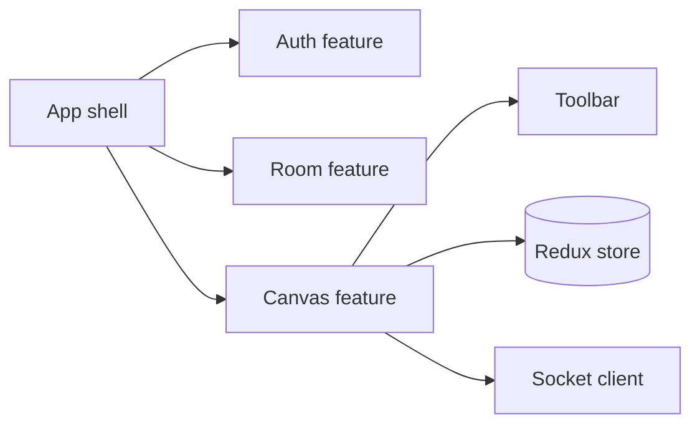

# Frontend Architecture

## Purpose
Describe the expected React structure and UI responsibilities.

## Core features
- authentication screen flow
- room list and create/join UI
- collaborative board workspace
- drawing toolbar and tool selection
- live participant list and presence indicator
- socket-based recreation and reconnection

## Key state boundaries
- React component state: transient form UI and local interaction state
- Redux: shared board and room state
- socket client: connection lifecycle and real-time events
- browser storage: optional session persistence or draft state

## Diagram

## Implementation status
Status: the React app implements authentication, room entry, collaborative canvas, toolbar, participant presence, Redux state, Socket.IO, IndexedDB offline support, and shape recognition. Automated frontend tests are not currently present.

## Related
- [Frontend structure](../04-frontend/frontend-structure.md)
- [State management](../04-frontend/state-management.md)
- [Socket client](../04-frontend/socket-client.md)
