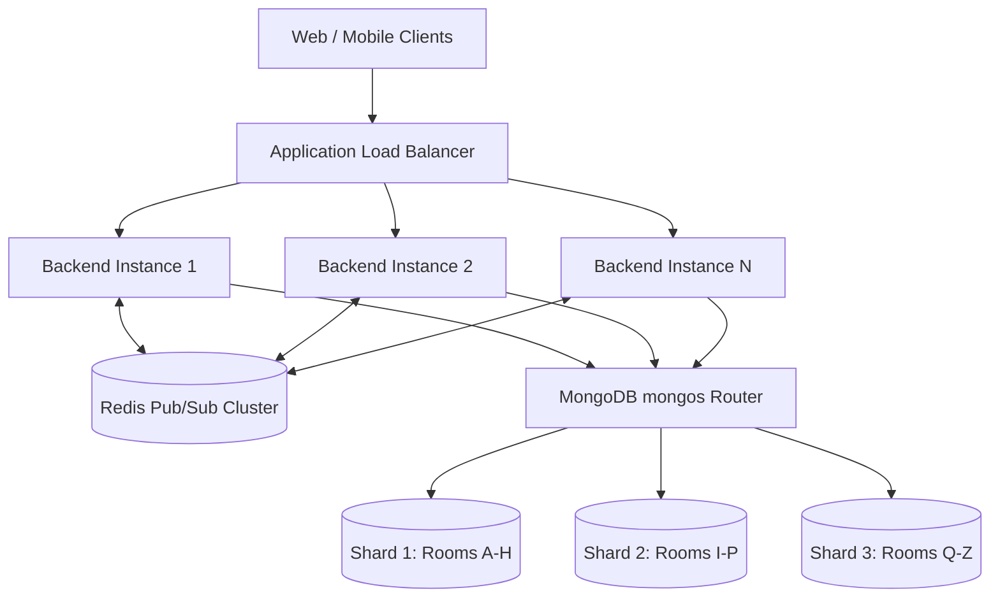

# Scalability and Sharding Architecture

## Purpose
Document the system's baseline **Single-Region deployment assumption** and provide a detailed blueprint for database sharding and real-time socket cluster scaling.

---

## 1. Single-Region Architecture Baseline

### Assumption
BoardCollab operates primarily within a **single cloud region** (e.g., `us-east-1` or `eu-central-1`).

### Rationale
- **Sub-50ms Collaboration Latency**: Collaborative drawing requires sub-100ms end-to-end event broadcast between participants. Single-region deployment eliminates cross-continent WAN round-trip latency.
- **Operational Simplicity**: Avoids distributed multi-master database consensus overhead, cross-region replication lag, and complex CRDT divergence across split-brain partitions.
- **Data Locality**: MongoDB replica sets and Redis clusters maintain microsecond-level latency to application backend pods.

---

## 2. Horizontal Scaling Architecture

When horizontal scaling is required within the single region:

---

## 3. Database Sharding Blueprint (MongoDB)

### Collection: `canvaselements`
- **Shard Key**: `{ roomId: "hashed" }`
- **Target**: High-throughput drawing strokes and shape mutations.
- **Why**: 
  - Hashing `roomId` guarantees a uniform distribution of rooms across all database shards.
  - All canvas elements belonging to the same room are co-located on the same shard chunk, allowing targeted single-shard queries for snapshots and exports without scatter-gather overhead.

### Collection: `sessions`
- **Shard Key**: `{ roomId: "hashed" }`
- **Why**: Co-locates active room sessions on the same shard as the canvas elements.

### Collection: `users`
- **Shard Key**: `{ email: "hashed" }`
- **Why**: Ensures uniform distribution of user accounts across shards and optimal point lookups during authentication.

---

## 4. Socket Cluster Scaling (Redis Adapter)

- Application pods run stateless Node.js / Socket.IO instances behind a Layer 7 Load Balancer with WebSocket sticky sessions enabled.
- Inter-instance room broadcasting is coordinated via the `@socket.io/redis-adapter` using Redis Pub/Sub channels keyed by `room:<roomId>`.
- Client heartbeats maintain ephemeral presence states in Redis Hashes with a 30-second TTL.

---

## 5. Multi-Region Expansion Roadmap (Future)

If global multi-region deployment is adopted:
1. **Room Affinity Routing**: Assign each room a "home region" upon creation based on the owner's geographic proximity.
2. **Geo-DNS Routing**: Any participant joining `room_123` is routed via Anycast/Geo-DNS to that room's home region.
3. **Cross-Region Read Replicas**: Secondary regions query read-only snapshots from cross-region MongoDB replicas for archived view-only sessions.

---

## Related
- [System assumptions and limits](../01-overview/system-assumptions-and-limits.md)
- [Scalability strategy](../09-scalability-and-performance/scalability-strategy.md)
- [Database overview](../06-data-design/database-overview.md)
