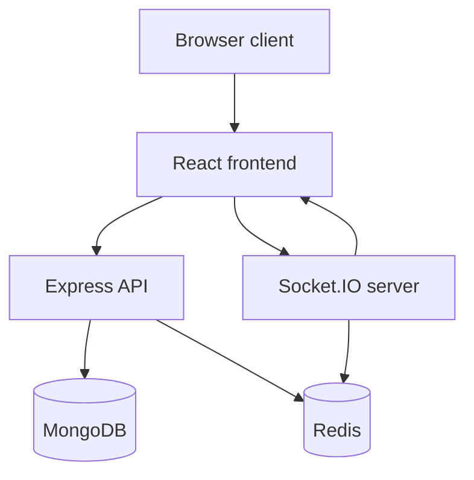

# System Architecture

## Purpose
Define the runtime system responsibilities and module boundaries for the BoardCollab monolith design.

## Responsibilities
### React frontend
- renders the board and application shell
- manages UI state and user interaction
- communicates with REST APIs and WebSockets
- optimistically updates canvas state while waiting for server acknowledgment

### Express API
- exposes auth, room, and export endpoints
- validates requests and ownership checks
- reads and writes durable application state via MongoDB
- issues JWT auth and restores user context

### Socket.IO server
- authenticates clients connecting to a room
- receives drawing operations and broadcast state changes
- enforces room membership and operation ordering expectations
- pushes presence and real-time updates to connected users

### MongoDB
- stores user, room, session, and canvas-element documents
- does not store the in-memory undo/redo history or collaboration room cache
- supports query-based room and user lookups

### Redis
- provides Socket.IO pub/sub fan-out when the Redis adapter connects
- is not used as the durable board store or general session cache

## Failure behavior
- Failed API calls return explicit HTTP errors.
- Socket disconnects trigger graceful reconnect and room rejoin flows.
- A Redis outage falls back to the in-process Socket.IO adapter; cross-process fan-out is unavailable in fallback mode.
- MongoDB failure blocks durable writes and should surface clear service errors.

## Diagram

## Implementation status
Status: core frontend, API, socket, MongoDB, and Redis-adapter paths are implemented. The diagrams include proposed scale and production-operation concerns that are not deployed by this repository.

## Related
- [Architecture diagrams](architecture-diagrams.md)
- [Backend architecture](backend-architecture.md)
- [Frontend architecture](frontend-architecture.md)
