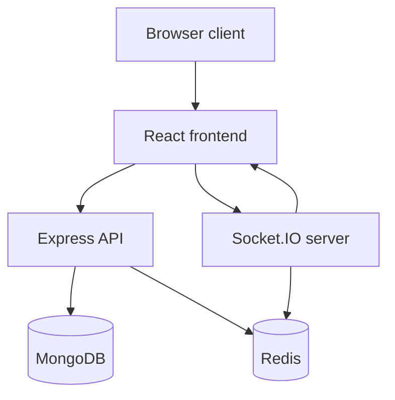

# System Architecture

## Purpose
Define the runtime system responsibilities and module boundaries for the BoardCollab monolith design.

## Responsibilities
### React frontend
- renders the board and application shell
- manages UI state and user interaction
- communicates with REST APIs and WebSockets
- optimistically updates canvas state while waiting for server acknowledgment

### Express API
- exposes auth, room, and export endpoints
- validates requests and ownership checks
- reads and writes durable application state via MongoDB
- issues JWT auth and restores user context

### Socket.IO server
- authenticates clients connecting to a room
- receives drawing operations and broadcast state changes
- enforces room membership and operation ordering expectations
- pushes presence and real-time updates to connected users

### MongoDB
- stores durable user, room, and board state
- retains snapshots, metadata, and undo history plans
- supports query-based room and user lookups

### Redis
- caches session metadata and lookup data
- supports pub/sub and socket fan-out for a multi-instance deployment
- stores transient ephemeral state such as reconnect tokens or throttling keys

## Failure behavior
- Failed API calls return explicit HTTP errors.
- Socket disconnects trigger graceful reconnect and room rejoin flows.
- A Redis outage should degrade non-critical caches without destroying durable state in MongoDB.
- MongoDB failure blocks durable writes and should surface clear service errors.

## Diagram

## Implementation status
Status: partial foundation implemented; full system design is planned.

## Related
- [Architecture diagrams](architecture-diagrams.md)
- [Backend architecture](backend-architecture.md)
- [Frontend architecture](frontend-architecture.md)
