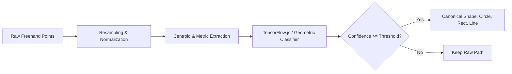

# AI Shape Recognition (TensorFlow.js)

## Purpose
Document the machine learning and geometric tensor processing pipeline used to detect freehand sketches and convert them into clean geometric shapes.

## Architecture

## Supported Primitives
1. **Line**: Computed via maximum chord deviation and end-to-end collinearity.
2. **Circle**: Measured by radial standard deviation from centroid ($\sigma_r / \bar{r} < 0.22$) and circularity coefficient.
3. **Rectangle**: Evaluated through corner angle histograms (orthogonal turns between $50^\circ$ and $130^\circ$) and bounding-box area fill.
4. **Triangle**: 3 prominent vertices with closure.
5. **Arrow**: Open path ending with acute angle return.

## Preprocessing Pipeline
- **Equidistant Resampling**: Resamples variable-frequency mouse/touch input into exactly 64 equidistant points ($N=64$).
- **Scale & Translation Invariance**: Extracts bounding box ($[minX, minY, maxX, maxY]$) and shifts centroid to origin $(0, 0)$ for tensor operations.
- **Closure Ratio**: Compares start-to-end distance against perimeter to distinguish open shapes (lines, arrows) from closed shapes (circles, rectangles).

## Environment Configuration
The shape recognition module is 100% environment-configurable via client `.env`:
- `VITE_ENABLE_AI_SHAPES`: Toggle shape recognition (`true` / `false`, default: `true`).
- `VITE_AI_CONFIDENCE_THRESHOLD`: Minimum confidence score to trigger auto-conversion (default: `0.70`).
- `VITE_AI_AUTO_CONVERT`: Whether to replace the stroke immediately upon mouse/touch release (default: `true`).

## Files
- Engine: [frontend/src/ai/shapeRecognizer.js](../../frontend/src/ai/shapeRecognizer.js)
- Configuration: [frontend/src/ai/recognizerConfig.js](../../frontend/src/ai/recognizerConfig.js)

## Related
- [Canvas rendering](canvas-rendering.md)
- [Canvas element schema](../06-data-design/canvas-element-schema.md)
