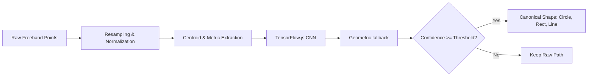

# AI Shape Recognition (TensorFlow.js)

## Purpose
Document the TensorFlow.js and geometric heuristic pipeline used to classify freehand strokes.

## Architecture

## Supported Primitives
The CNN classifies five labels: line, circle, rectangle, triangle, and freeform path. The geometric fallback currently converts open, low-deviation lines, near-circular closed paths, and closed bounding boxes to line, circle, and rectangle elements. Triangle recognition is available through the CNN path; arrows are not a supported classifier label.

## Preprocessing Pipeline
- **Equidistant Resampling**: Resamples variable-frequency mouse/touch input into exactly 64 equidistant points ($N=64$).
- **Scale & Translation Invariance**: Extracts bounding box ($[minX, minY, maxX, maxY]$) and shifts centroid to origin $(0, 0)$ for tensor operations.
- **Closure Ratio**: Compares start-to-end distance against perimeter to distinguish open shapes (lines, arrows) from closed shapes (circles, rectangles).

## Runtime behavior
Shape recognition is user-toggleable in the board UI. Enabling it loads or trains a lightweight CNN using generated synthetic strokes and stores its model in browser IndexedDB. The confidence threshold is a code constant (`0.70`), not an environment variable. If the CNN is not ready or does not meet the threshold, geometric heuristics are tried.

## Files
- Engine: [frontend/src/ai/shapeRecognizer.js](../../frontend/src/ai/shapeRecognizer.js)
- Configuration: [frontend/src/ai/recognizerConfig.js](../../frontend/src/ai/recognizerConfig.js)

## Related
- [Canvas rendering](canvas-rendering.md)
- [Canvas element schema](../06-data-design/canvas-element-schema.md)
