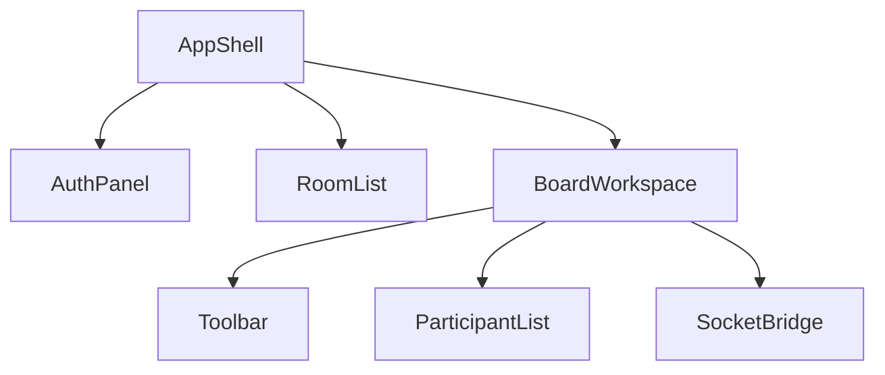

# Component Architecture

## Purpose
Describe the likely component layout for a collaborative whiteboard UI.

## Key components
- AppShell
- AuthPanel
- RoomList
- CreateRoomDialog
- BoardWorkspace
- Toolbar
- ToolbarButton
- ParticipantList
- PresenceBadge
- ToastRegion

## Data ownership
- presentational state belongs in components
- domain state belongs in Redux or the socket client
- shared room and canvas state should not be duplicated across unrelated components

## Diagram

## Implementation status
Status: planned architecture; current UI is a static landing page.

## Related
- [Frontend structure](frontend-structure.md)
- [Canvas rendering](canvas-rendering.md)
- [State management](state-management.md)
