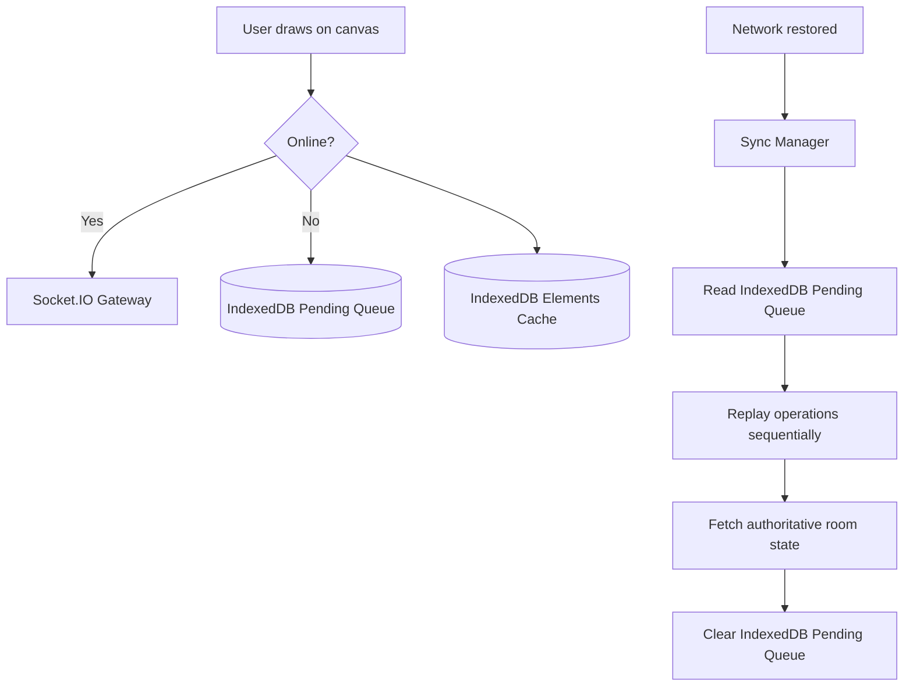

# Offline and Reconnection Architecture

## Purpose
Describe how BoardCollab achieves resilience during temporary network disruptions and full offline usage through a Progressive Web App (PWA) architecture utilizing **Service Workers** and **IndexedDB**.

## Architecture Overview

## Key Components

### 1. Service Worker (`frontend/public/sw.js`)
- **Asset Caching**: Pre-caches foundational HTML, CSS, JavaScript, and fonts using CacheStorage.
- **Cache Strategy**: Stale-while-revalidate for static bundles; Network-first for navigation requests.
- **Background Sync**: Listens to the `sync` event (`boardcollab-replay-sync`) via the Background Sync API to wake up the replay worker as soon as connectivity returns.

### 2. IndexedDB Storage (`frontend/src/offline/indexedDb.js`)
Database Name: `boardcollab_offline_db` (Version 1).
- **`rooms` Store**: Stores room metadata (`id`, `name`, `description`, `visibility`, `updatedAt`).
- **`elements` Store**: Stores local copy of canvas elements indexed by `roomId` and `updatedAt`. Enables instant offline room rendering without a network trip.
- **`pendingQueue` Store**: Stores chronological log of mutations performed while offline (`roomId`, `type`, `payload`, `timestamp`, `status`).

### 3. Synchronization Manager (`frontend/src/offline/syncManager.js`)
- Listens to `window.addEventListener('online')`, `window.addEventListener('offline')`, and socket connection lifecycle events.
- **Optimistic UI**: Immediately renders strokes and updates local IndexedDB storage.
- **Sequential Replay**: When connection re-establishes, pending operations are submitted sequentially with idempotent element IDs.
- **Reconciliation**: Once the queue is flushed, the client reconciles its local state against the server snapshot (`room:state`) to ensure cross-client consistency.

## Environment Variables
- `VITE_ENABLE_SW`: Set to `"true"` or `"false"` to enable or disable the Service Worker.
- `VITE_API_URL`: Backend REST API endpoint.
- `VITE_SOCKET_URL`: Socket.IO endpoint.

## Related
- [Socket client](socket-client.md)
- [Real-time communication](../02-architecture/real-time-communication.md)
- [Persistence and recovery](../07-realtime-and-consistency/persistence-and-recovery.md)
