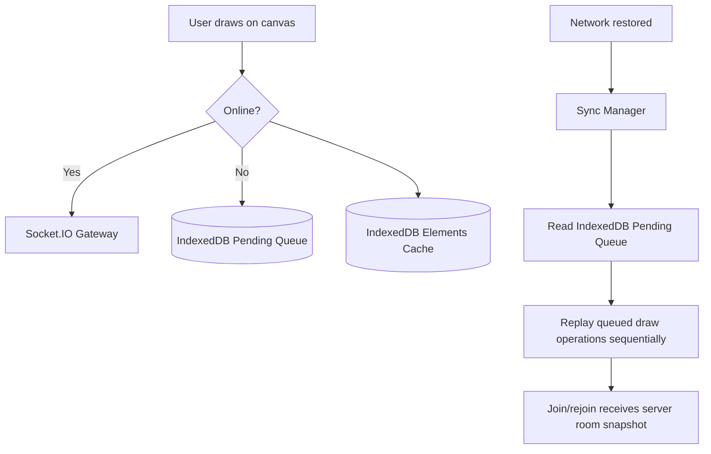

# Offline and Reconnection Architecture

## Purpose
Describe the client-side offline shell, element cache, and queued drawing replay. This provides limited offline resilience, not a complete offline-first application.

## Architecture Overview

## Key Components

### 1. Service Worker (`frontend/public/sw.js`)
- **Asset Caching**: Pre-caches `/` and `/index.html`; other GET assets use a runtime stale-while-revalidate cache.
- **Cache Strategy**: Network-first for navigation requests, with cached HTML fallback; API and Socket.IO requests bypass the service worker.
- **Background Sync**: Handles `boardcollab-replay-sync` by notifying open clients. The application currently does not register this sync tag, so active replay is triggered by browser `online` and socket `connect` events.

### 2. IndexedDB Storage (`frontend/src/offline/indexedDb.js`)
Database Name: `boardcollab_offline_db` (Version 1).
- **`rooms` Store**: Created in the database schema; no current helper populates it.
- **`elements` Store**: Stores the current Redux canvas elements indexed by `roomId`; room entry loads this cache if the server returns no elements.
- **`pendingQueue` Store**: Stores chronological log of mutations performed while offline (`roomId`, `type`, `payload`, `timestamp`, `status`).

### 3. Synchronization Manager (`frontend/src/offline/syncManager.js`)
- Listens to `window.addEventListener('online')`, `window.addEventListener('offline')`, and socket connection lifecycle events.
- **Optimistic UI**: Immediately renders strokes and queues them in IndexedDB when offline.
- **Sequential Replay**: Replays queued draw events after connectivity returns; server acknowledgements determine queue removal.
- **Reconciliation**: Socket room join/rejoin hydrates the client from `room:state`; this is not a general conflict-free merge protocol.

## Environment Variables
- `VITE_ENABLE_SW`: Set to `"false"` to disable service-worker registration; otherwise registration is enabled by default.
- `VITE_API_URL`: Backend REST API endpoint.
- `VITE_SOCKET_URL`: Socket.IO endpoint.

## Related
- [Socket client](socket-client.md)
- [Real-time communication](../02-architecture/real-time-communication.md)
- [Persistence and recovery](../07-realtime-and-consistency/persistence-and-recovery.md)
