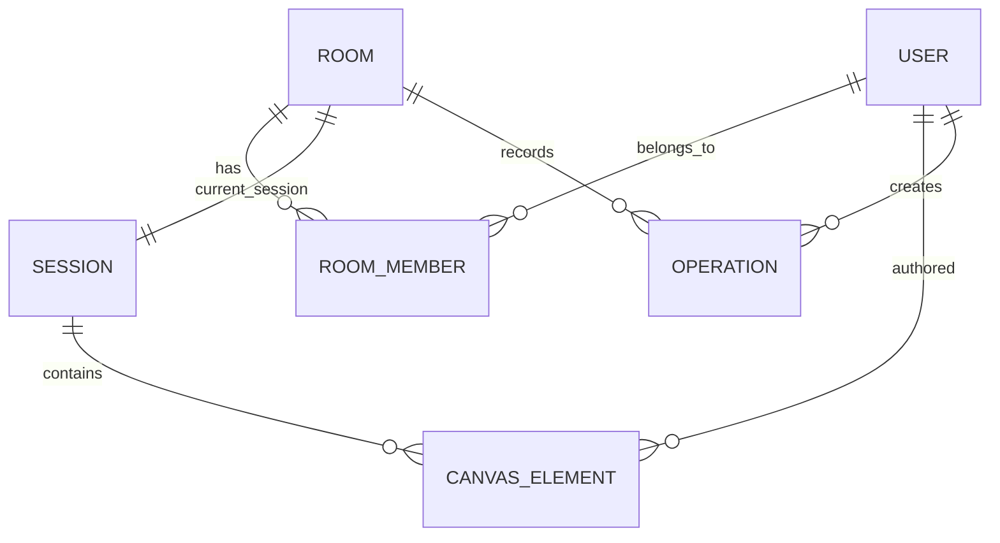

# Entity Relationship Diagram

## Purpose
Show the logical relationships across the main board domain entities.

## Notes
- a user may belong to many rooms
- a room can own many sessions over time
- the canvas is persisted as elements and/or operation history
- ownership and membership must be enforced at the API and socket layers

## Implementation status
Status: conceptual model only.

## Related
- [Database overview](database-overview.md)
- [User schema](user-schema.md)
- [Room and session schema](room-and-session-schema.md)
