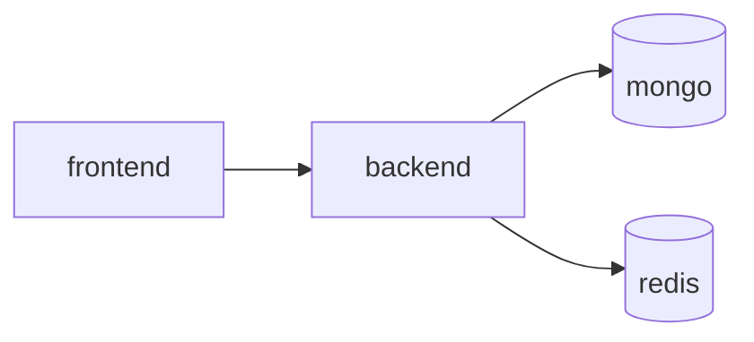

# Docker Architecture

## Purpose
Explain the local development and production app-container architectures used by the repository.

## Services
- `mongo`: MongoDB 7 container
- `redis`: Redis 7 with append-only persistence enabled
- `backend`: Node.js API service
- `frontend`: Vite app exposed to the host

## Container boundaries
Containers share a Docker network and communicate using service names such as `mongo` and `redis` instead of absolute host addresses. Local development may also access them via host ports, but internal services should use Docker DNS.

## Diagram

## Implementation status
Status: development services are defined in `docker-compose.yml`; production backend and frontend targets are defined in the Dockerfiles and `docker-compose.prod.yml`.

## Related
- [Docker compose services](docker-compose-services.md)
- [Networking and ports](networking-and-ports.md)
- [Environment configuration](environment-configuration.md)
